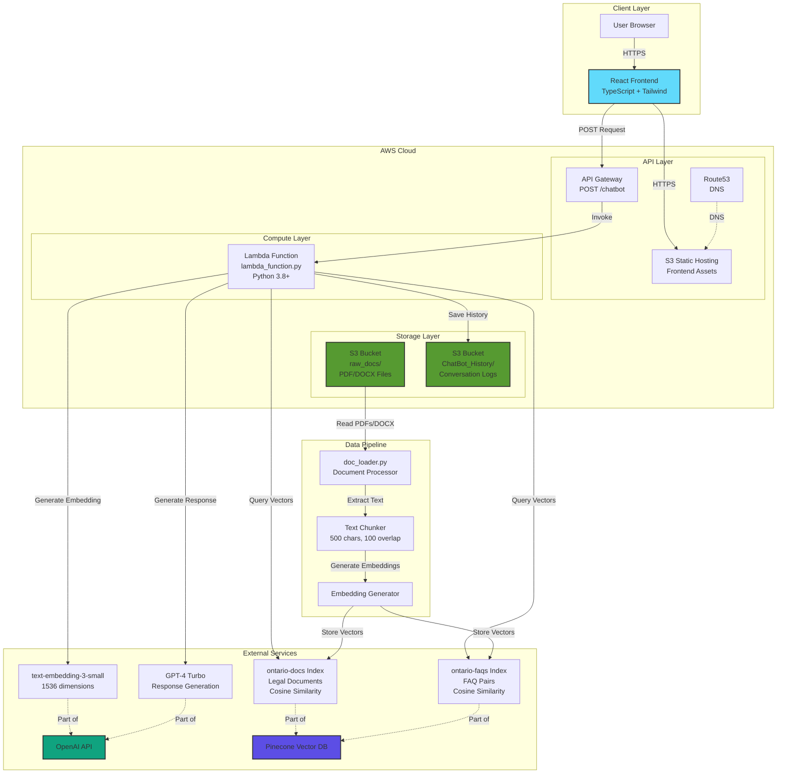
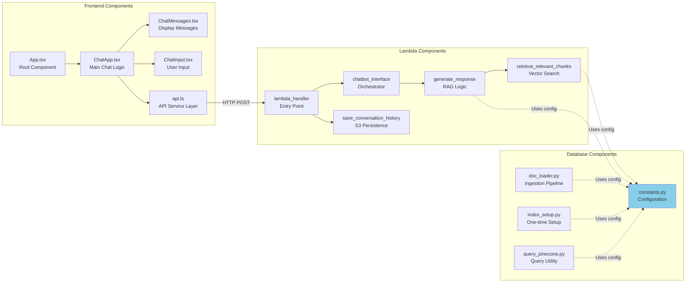
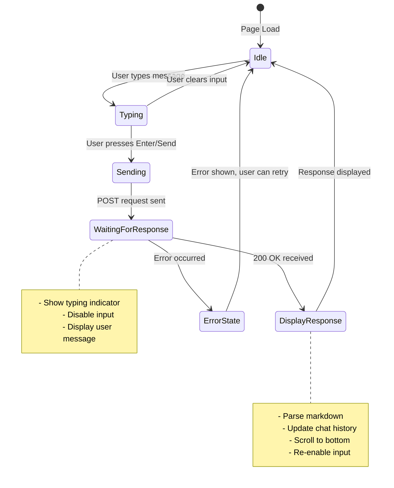
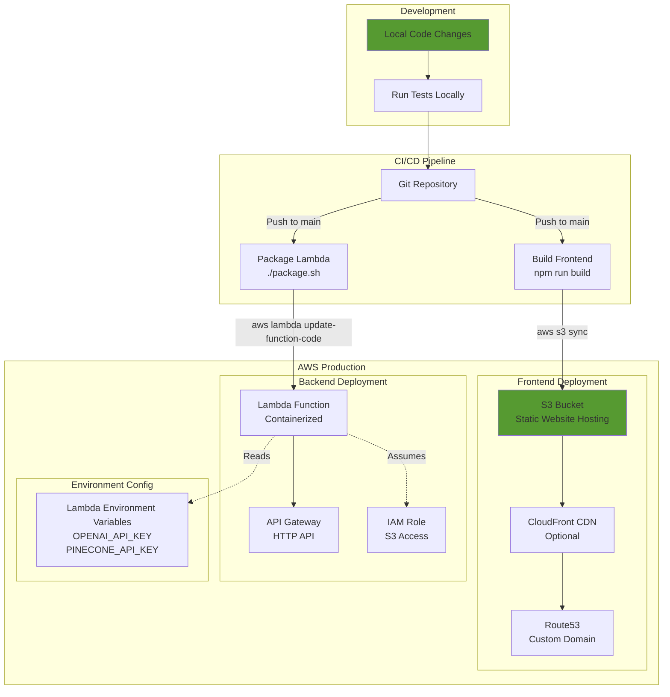
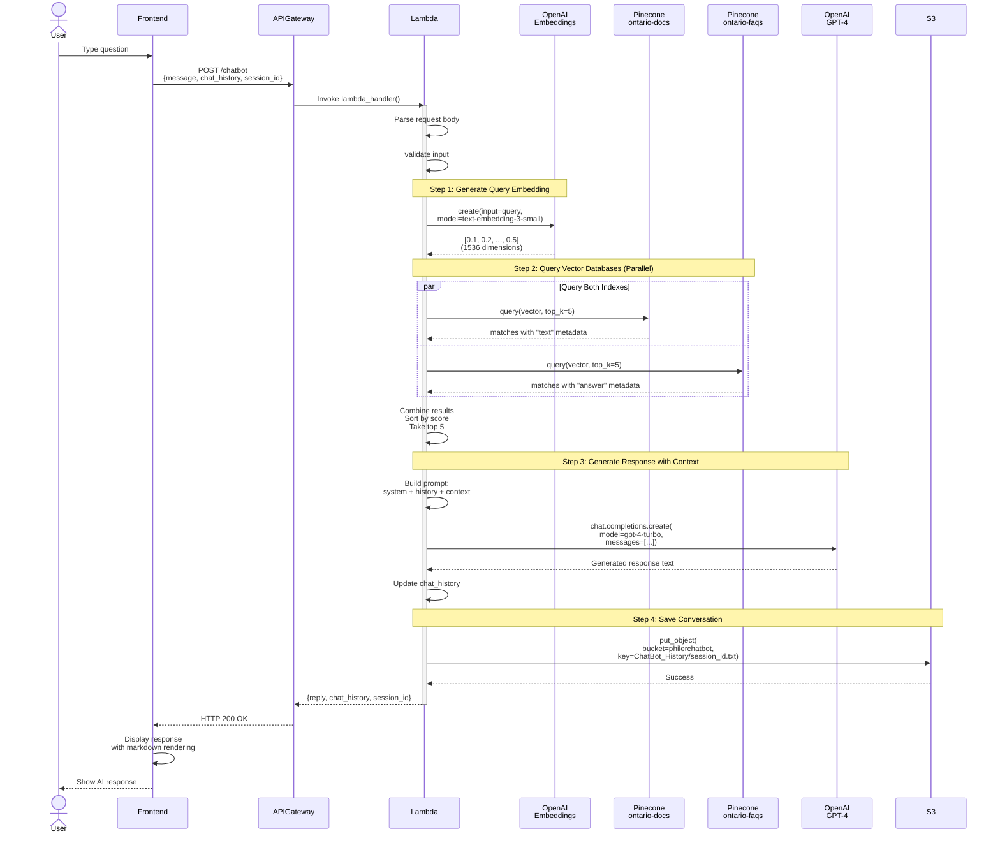
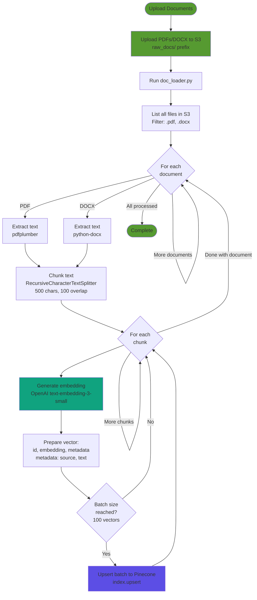

<div align="center">

# Serverless Legal RAG Chatbot for Ontario Real Estate

### AI-powered legal assistant for Ontario real estate, built with a fully serverless RAG architecture

[](https://www.python.org/)
[](https://www.typescriptlang.org/)
[](https://reactjs.org/)
[](https://aws.amazon.com/)
[](https://openai.com/)
[](https://www.pinecone.io/)

A production-ready Retrieval-Augmented Generation (RAG) chatbot that answers questions about Ontario real estate closings and refinancing using GPT-4 Turbo and Pinecone deployed on AWS.

[Live Demo](https://chat.philer.ai/) • [Repository](https://github.com/omarafify7/Serverless-Legal-RAG-Chatbot-for-Ontario-Real-Estate)

</div>

## Overview
This project is a production-ready Retrieval-Augmented Generation (RAG) chatbot that answers questions about Ontario real estate legal documents. It combines vector similarity search with GPT-4 to deliver accurate, context-aware guidance based on both formal documents and FAQs, all deployed on a serverless AWS stack.

The system includes a modern React frontend, a containerized AWS Lambda backend, a Pinecone vector database, and an ingestion pipeline that processes PDFs/DOCX from S3 into searchable embeddings.

## Architecture

At a high level, the system consists of:

- **Frontend (`my-chatbot-frontend/`)**
  - `ChatApp.tsx`: main chat container managing state and API calls.
  - `components/ChatMessages.tsx`: renders user and assistant messages with markdown.
  - `components/ChatInput.tsx`: input + send UI.
  - `services/api.ts`: service layer for calling the `/chatbot` API.
  - Deployed as a static site on **AWS S3**.

- **Backend (root `lambda_function.py`)**
  - `lambda_handler`: AWS Lambda entry point invoked by **API Gateway**.
  - `retrieve_relevant_chunks_from_pinecone`: generates a query embedding, queries two Pinecone indexes (`ontario-docs`, `ontario-faqs`), and returns top-K context chunks.
  - `generate_response`: constructs the RAG prompt using context + chat history and calls **GPT-4 Turbo**.
  - `chatbot_interface`: orchestrates the chat flow for a single request.
  - `save_conversation_history`: persists formatted conversation logs to **S3** under `ChatBot_History/`.

- **Data ingestion pipeline (`database/`)**
  - `doc_loader.py`: pulls PDF/DOCX from S3 (`raw_docs/`), extracts text, chunks with `RecursiveCharacterTextSplitter`, embeds with `text-embedding-3-small`, and upserts to Pinecone.
  - `constants.py`: central config for embedding models, chunk sizes, index names, and other parameters.
  - `index_setup.py`: one-time script to create the Pinecone indexes.
  - `query_pinecone.py`: standalone query utility using LangChain for manual testing.
  - `database/tests/`: unit tests for the ingestion pipeline.

- **Docs & deployment**
  - `docs/architecture.md`: deep dive into the system design.
  - `docs/api.md`: API contract and payload shapes.
  - `deployment/lambda/package.sh`: packaging script for shipping Lambda with dependencies.

### Architecture Diagram



### Component Interactions



### Frontend State Management



### Deployment Architecture



### Query Flow Summary

1. User enters a question in the React frontend.
2. Frontend sends a POST request to the API Gateway `/chatbot` endpoint.
3. Lambda:

   * Creates a query embedding using `text-embedding-3-small`.
   * Queries both Pinecone indexes (`ontario-docs`, `ontario-faqs`) with `top_k` results.
   * Combines and re-ranks results, selecting the best chunks as context.
   * Calls GPT-4 Turbo with a system prompt, chat history, and context.
   * Saves the conversation to S3 and returns the assistant reply plus updated history.
4. Frontend renders the response as markdown and updates the chat history in the UI.

#### Query Processing Flow (Detailed)



### Ingestion Flow Summary

1. Legal PDFs/DOCX are uploaded to S3 under `raw_docs/`.
2. `database/doc_loader.py`:

   * Downloads each file from S3.
   * Extracts text with `pdfplumber` or `python-docx`.
   * Chunks text (500 characters, 100-character overlap) using LangChain's `RecursiveCharacterTextSplitter`.
   * Generates embeddings in batches using `text-embedding-3-small`.
   * Upserts the vectors and metadata into the appropriate Pinecone index.

#### Document Ingestion Pipeline (Detailed)


## Features
- **Legal RAG assistant for Ontario real estate** – answers questions about closings, refinancing, and other real estate topics using real legal documents and FAQs.
- **Dual-index retrieval** – queries both a legal-documents index and an FAQ index in Pinecone, then ranks and combines results for richer context.
- **GPT-4 Turbo responses with context** – generates responses using GPT-4 Turbo conditioned on retrieved document chunks and conversation history.
- **Document ingestion pipeline** – extracts text from PDF/DOCX in S3, chunks it, embeds it, and upserts vectors into Pinecone.
- **Multi-turn chat** – tracks conversation history to support follow-up questions and more natural interactions.
- **Conversation persistence** – writes full conversation logs to S3 for auditing, debugging, or analytics.
- **Serverless deployment** – backend runs on AWS Lambda behind API Gateway, with automatic scaling and pay-per-use pricing.
- **Type-safe frontend** – React + TypeScript frontend with Tailwind styling and markdown rendering for assistant responses.
- **Testing & tooling** – pytest-based test suites, Black, isort, mypy, and dev requirements for a production-style workflow.

## Tech Stack

* **Languages**

  * Python 3.8+
  * TypeScript
  * JavaScript

* **Backend / ML / Data**

  * OpenAI API (GPT-4 Turbo, `text-embedding-3-small`)
  * Pinecone vector database (serverless, cosine similarity)
  * LangChain (text splitting & optional retrieval utilities)
  * tiktoken (token-aware chunking)
  * pdfplumber, python-docx (document parsing)

* **Frontend**

  * React 19
  * Tailwind CSS
  * `marked` (markdown rendering)

* **Cloud / Infra**

  * AWS Lambda (containerized)
  * AWS API Gateway
  * AWS S3 (static frontend hosting + data + conversation history)
  * Docker (Lambda packaging)

* **Tooling & Testing**

  * pytest, pytest-cov, pytest-mock
  * Black, isort, mypy, flake8
  * `pyproject.toml`, `pytest.ini`, `requirements-dev.txt`

## Setup & Usage

### Prerequisites

* Python **3.8+**
* Node.js **16+**
* An **AWS** account with CLI configured
* **Pinecone** account + API key
* **OpenAI** API key

### 1. Clone and configure environment

```bash
git clone <your-repo-url>.git
cd chatbot
```

Create a `.env` file at the project root:

```env
OPENAI_API_KEY=your_openai_key
PINECONE_API_KEY=your_pinecone_key
PINECONE_INDEX_NAME=ontario-docs
PINECONE_FAQ_INDEX_NAME=ontario-faqs
AWS_ACCESS_KEY_ID=your_aws_access_key
AWS_SECRET_ACCESS_KEY=your_aws_secret
AWS_REGION=us-east-1
S3_BUCKET_NAME=philerchatbot
```

> For the frontend, you can optionally create `my-chatbot-frontend/.env.local` with:
>
> ```env
> REACT_APP_API_URL=https://your-api-gateway-url.execute-api.region.amazonaws.com/dev
> ```

### 2. Set up the ingestion environment

```bash
pip install -r database/requirements.txt
```

Create Pinecone indexes (one-time):

```bash
python database/index_setup.py
```

Upload your PDF/DOCX legal documents to S3 under `raw_docs/`, then run:

```bash
python database/doc_loader.py
```

This will extract text, chunk, embed, and populate the `ontario-docs` and `ontario-faqs` indexes.

### 3. Run tests (optional, recommended)

```bash
pytest
# or to include database tests:
pytest tests/ database/tests/
```

### 4. Package and deploy the Lambda

```bash
cd deployment/lambda
./package.sh
# then use AWS CLI to update the function, e.g.:
aws lambda update-function-code \
  --function-name YOUR_LAMBDA_NAME \
  --zip-file fileb://lambda_package.zip
```

Make sure your Lambda environment variables match the `.env` values (OpenAI, Pinecone, S3, etc.).

Set up an API Gateway HTTP API with a `POST /chatbot` route pointing to the Lambda.

### 5. Run the frontend

```bash
cd my-chatbot-frontend
npm install
npm start
```

Open `http://localhost:3000` in your browser for local development.

To build for production:

```bash
npm run build
# then deploy build/ to an S3 static hosting bucket
```

### 6. API Usage

**Endpoint**: `POST /chatbot` (behind API Gateway)

**Request body:**

```json
{
  "message": "What documents do I need for closing?",
  "chat_history": [
    {"role": "system", "content": "You are a legal assistant..."},
    {"role": "user", "content": "Previous question"},
    {"role": "assistant", "content": "Previous answer"}
  ],
  "session_id": "uuid-string"
}
```

**Response body:**

```json
{
  "reply": "For a real estate closing in Ontario, you need...",
  "chat_history": [...],
  "session_id": "uuid-string"
}
```

## UI Screenshots
Home Page:


After sending a message:


Response:


## What I Learned

* How to design and ship a **production-ready RAG system** that combines OpenAI, Pinecone, and AWS serverless components.
* How to build a **dual-index retrieval pipeline** that merges results from legal documents and FAQs into a unified context.
* How to structure a project with **clear separation of concerns**: ingestion, serving (Lambda), and presentation (React frontend).
* How to implement **document ingestion pipelines** for PDFs and DOCX, including text extraction, chunking, and embedding.
* How to use **pytest and modern Python tooling** (Black, isort, mypy) to keep a non-trivial codebase maintainable.

## Future Improvements

* Add **rate limiting** to protect the API in production.
* Deliver **explicit citations** and document sources directly in the UI for better transparency.
* Implement **response streaming** from the backend for a more responsive chat experience.
* Tighten **CORS configuration** and environment isolation (dev/stage/prod S3 buckets and indexes).

## License

Private.

