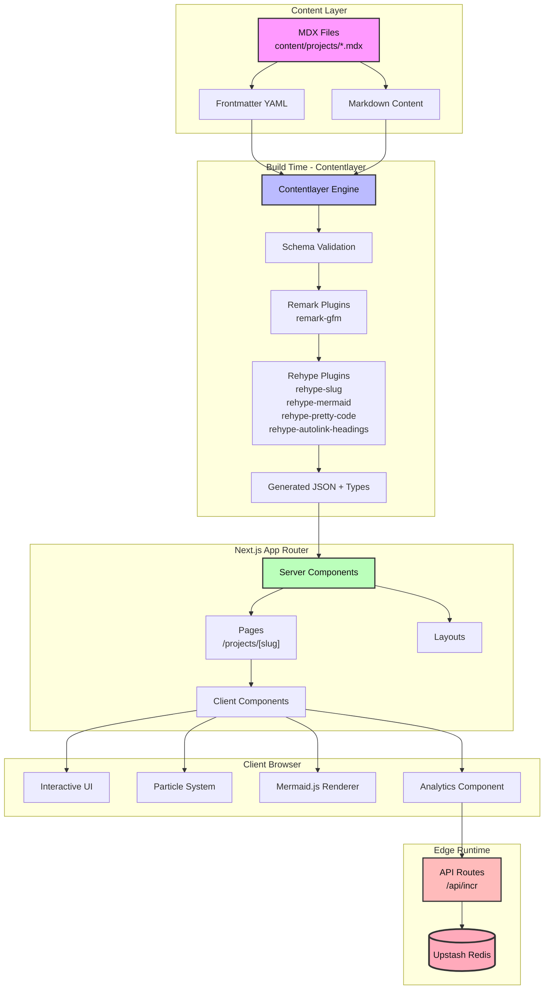
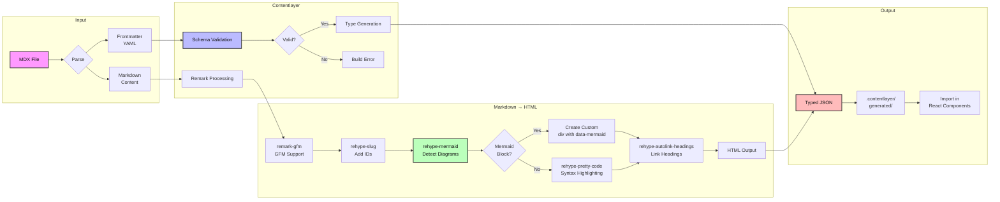
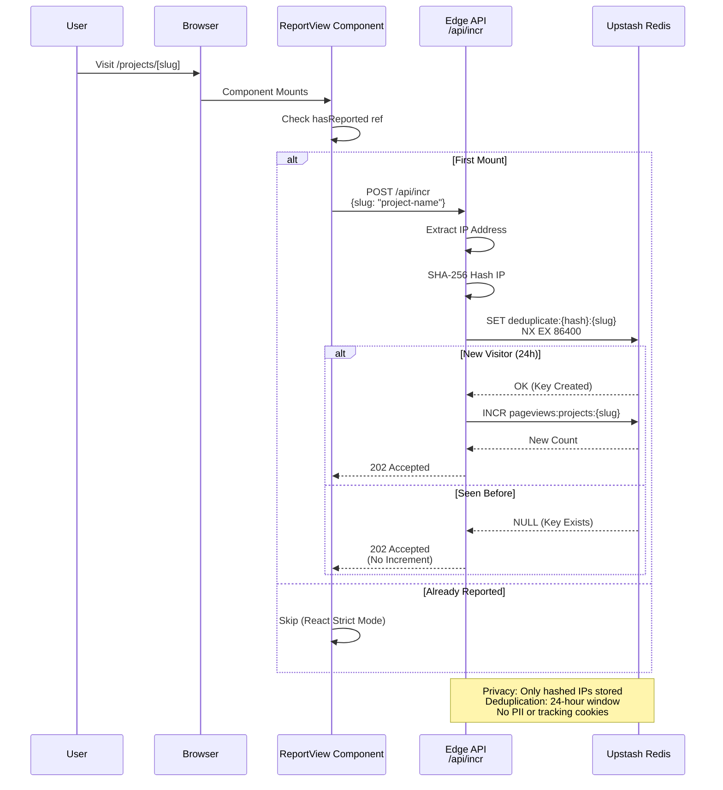
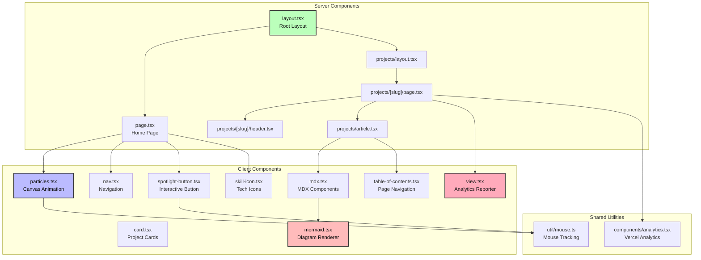

<div align="center">

# omarafify.com

### Modern Portfolio Engine with Custom MDX Pipeline & Edge Analytics

[](https://nextjs.org/)
[](https://www.typescriptlang.org/)
[](https://reactjs.org/)
[](https://tailwindcss.com/)
[](https://vercel.com)

A high-performance portfolio platform built with Next.js 13 App Router, featuring a custom MDX content pipeline, privacy-preserving edge analytics, and interactive UI components.

[Live Demo](https://omarafify.com) • [View Projects](https://omarafify.com/projects)

</div>

## Overview

This portfolio platform is designed to showcase engineering projects and technical skills through an optimized, modern web experience. Built on Next.js 13's App Router with React Server Components, it combines:

- **Custom MDX Content Pipeline** using Contentlayer with semantic processing
- **Edge-based Analytics** with Upstash Redis for privacy-preserving view tracking
- **Interactive Visualizations** including Mermaid diagrams and particle animations
- **End-to-end Type Safety** via TypeScript and validated content schemas

The platform prioritizes performance, privacy, and developer experience while maintaining a visually stunning interface.

## Architecture

### System Architecture



### Content Processing Pipeline



### Analytics Pipeline



### Component Architecture



## Key Features

### 🚀 Next.js 13 App Router
Full utilization of React Server Components for optimal initial load performance and automatic code splitting.

### 📝 Custom MDX Engine
Semantic content processing with extensible plugin architecture:
- **Syntax Highlighting:** `rehype-pretty-code` with GitHub Dark theme
- **Auto-linked Headings:** Automatic anchor generation with `rehype-slug` and `rehype-autolink-headings`
- **GFM Support:** Tables, task lists, and strikethrough via `remark-gfm`
- **Custom Mermaid Plugin:** `lib/rehype-mermaid.js` intercepts diagram code blocks before syntax highlighting

### 📊 Edge Analytics
Privacy-preserving view tracking system:
- **Edge Runtime:** Runs on Vercel Edge Network for global low-latency
- **IP Hashing:** SHA-256 hashing ensures no PII storage (`pages/api/incr.ts`)
- **Deduplication:** 24-hour Redis key expiration prevents double-counting
- **Atomic Operations:** Redis `INCR` ensures accurate concurrent updates

### 🎨 Interactive Diagrams
Integrated Mermaid.js support with zoom/pan controls:
- Diagrams defined in markdown code blocks
- Client-side rendering with `mermaid.tsx`
- Powered by `react-zoom-pan-pinch` for interactive exploration

### 🌈 Dynamic UI
Premium visual experience:
- **Particle System:** WebGL-accelerated canvas with mouse magnetism (`particles.tsx`)
- **Spotlight Buttons:** Proximity-based hover effects (`spotlight-button.tsx`)
- **Smooth Animations:** Framer Motion for declarative transitions
- **Responsive Design:** Tailwind CSS with mobile-first approach

### 🔒 Type Safety
End-to-end type safety for content:
- **Schema Validation:** Contentlayer validates frontmatter against TypeScript schemas
- **Generated Types:** Automatic type generation for content files
- **TypeScript Strict Mode:** Prevents runtime errors during development

## Tech Stack

### Core Framework
- **[Next.js 13](https://nextjs.org/)** - React framework with App Router
- **[React 18](https://reactjs.org/)** - UI library with Server Components
- **[TypeScript 5.2](https://www.typescriptlang.org/)** - Type-safe JavaScript

### Content Management
- **[Contentlayer 0.3](https://contentlayer.dev/)** - Content SDK for type-safe MDX
- **[MDX](https://mdxjs.com/)** - Markdown with JSX components
- **[Remark](https://remark.js.org/)** / **[Rehype](https://github.com/rehypejs/rehype)** - Markdown/HTML processors

### Data & Infrastructure
- **[Upstash Redis](https://upstash.com/)** - Serverless Redis for analytics
- **[Vercel Edge Runtime](https://vercel.com/docs/functions/edge-functions)** - Edge computing platform
- **[Vercel Analytics](https://vercel.com/analytics)** - Web vitals monitoring

### Styling & UI
- **[Tailwind CSS 3.3](https://tailwindcss.com/)** - Utility-first CSS framework
- **[Framer Motion](https://www.framer.com/motion/)** - Animation library
- **[Lucide React](https://lucide.dev/)** - Icon library

### Visualization
- **[Mermaid.js](https://mermaid.js.org/)** - Diagram rendering
- **[HTML5 Canvas](https://developer.mozilla.org/en-US/docs/Web/API/Canvas_API)** - Particle animations
- **[react-zoom-pan-pinch](https://github.com/BetterTyped/react-zoom-pan-pinch)** - Interactive diagram controls

## Quick Start

### Prerequisites

- **Node.js 18+**
- **pnpm**

### Installation

1. **Clone the repository:**
   ```bash
   git clone https://github.com/omarafify/omarafify.com.git
   cd omarafify.com
   ```

2. **Install dependencies:**
   ```bash
   pnpm install
   ```

3. **Configure environment variables:**
   
   Create a `.env` file in the root directory:
   ```bash
   UPSTASH_REDIS_REST_URL=your-upstash-url
   UPSTASH_REDIS_REST_TOKEN=your-upstash-token
   NEXT_PUBLIC_BEAM_TOKEN=optional-analytics-token
   ```

4. **Run the development server:**
   ```bash
   pnpm dev
   ```
   
   Open [http://localhost:3000](http://localhost:3000) in your browser.

## Development

### Project Structure

```
omarafify.com/
├── app/                      # Next.js App Router
│   ├── components/           # React components
│   │   ├── particles.tsx    # Canvas particle system
│   │   ├── mermaid.tsx      # Mermaid diagram renderer
│   │   ├── mdx.tsx          # MDX component mappings
│   │   └── ...
│   ├── projects/            # Projects section
│   │   ├── [slug]/          # Dynamic project pages
│   │   └── page.tsx         # Projects listing
│   ├── layout.tsx           # Root layout
│   └── page.tsx             # Home page
├── content/                 # MDX content files
│   └── projects/            # Project markdown files
├── lib/                     # Utilities and plugins
│   └── rehype-mermaid.js   # Custom rehype plugin
├── pages/api/               # API routes
│   └── incr.ts             # Analytics endpoint
├── public/                  # Static assets
├── util/                    # Helper functions
├── contentlayer.config.js  # Content schema & config
└── tailwind.config.js      # Tailwind configuration
```

## What I Learned

### Edge Computing Constraints
Adapting API routes to the Vercel Edge Runtime required fundamental changes:
- **No Node.js APIs:** Switched from native `crypto` to Web Crypto API
- **No TCP Connections:** Used Upstash's REST API instead of Redis protocol
- **Stateless Functions:** Designed for instant cold starts and global distribution

### AST Transformations
Building the custom Mermaid plugin (`lib/rehype-mermaid.js`) taught me:
- **How markdown parsers create Abstract Syntax Trees (ASTs)**
- **Plugin execution order matters** (must run before syntax highlighting)
- **Transforming nodes while preserving document structure**

### React Server Components
Learned the new paradigm of data fetching and rendering:
- **Server Components:** Fetch data, access databases, render static content
- **Client Components:** Handle interactivity, use hooks, access browser APIs
- **Boundaries:** Strategic "use client" directives for minimal client JavaScript

## Future Improvements

### Migration from Contentlayer
Contentlayer is deprecated. Plan to migrate to:
- **Option 1:** Next.js built-in MDX support with custom loader
- **Option 2:** Velite as a direct replacement
- **Option 3:** Custom build-time processor

### Search Functionality
Implement client-side fuzzy search:
- Index project metadata (title, description, tech stack)
- Use Fuse.js for fuzzy matching
- Filter and sort projects dynamically

### Testing Suite
Add comprehensive testing:
- **Unit Tests:** Jest for utilities and components
- **Integration Tests:** Test MDX pipeline and content processing
- **E2E Tests:** Playwright for user flows and analytics verification

### Performance Optimizations
- Implement incremental static regeneration (ISR) for projects
- Add image optimization with Next.js Image component
- Optimize particle system with WebGL shaders
